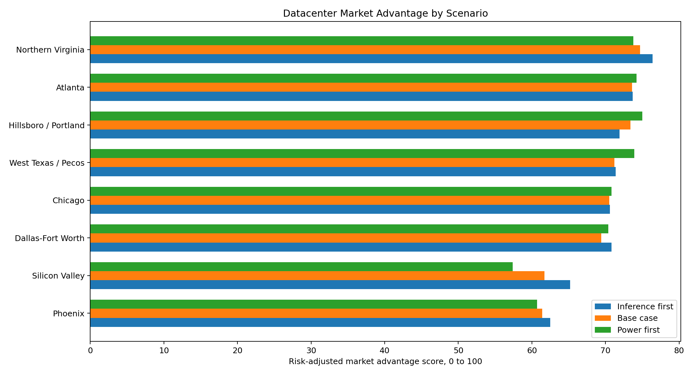
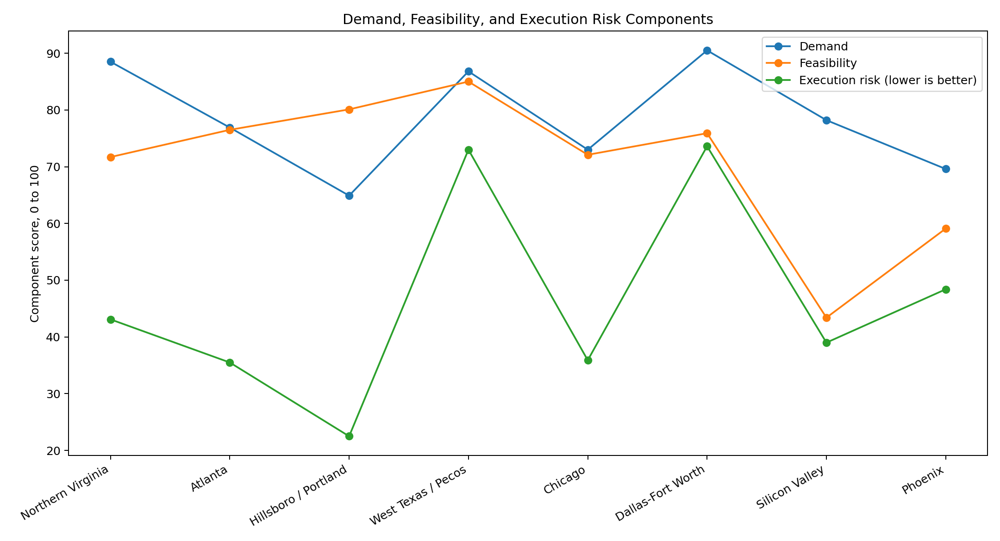

# Datacenter Market Analytics Model

Independent work sample for a Microsoft Cloud Operations + Innovation market analytics TPM role.

## Why This Exists

The target role asks for a repeatable way to quantify datacenter market advantage across market entry, market capture, targeted workloads, infrastructure, and competitive landscape. This project shows how I would structure that problem as a small, auditable decision model.

It does not claim internal Microsoft knowledge. It uses public sources, explicit assumptions, and scenario weights that can be challenged or replaced with third-party analyst data.

## Executive Answer

The model ranks markets by risk-adjusted advantage for AI and cloud datacenter capacity planning.

Base case results prioritize:

1. Northern Virginia
2. Atlanta
3. Hillsboro / Portland

The result is intentionally not "build everywhere demand is high." The model separates demand strength from execution feasibility and local risk, because a market can be strategically important but still unattractive for incremental capture if power, permitting, or capacity timing are constrained. In the power-first scenario, the ranking shifts toward markets with stronger delivery feasibility.

## What The Model Measures

The score combines three components:

| Component | What It Answers |
| --- | --- |
| Demand | Is there evidence of hyperscale, AI, cloud, or inference demand? |
| Feasibility | Can capacity plausibly come online with acceptable power, cost, cooling, and fiber conditions? |
| Risk | Where can load growth, water exposure, or community pressure slow execution? |

Three scenarios are generated:

| Scenario | Use Case |
| --- | --- |
| Base case | Balanced market-entry view |
| Power first | Faster capacity delivery and lower power-cost exposure |
| Inference first | Regional inference demand, latency, and workload fit |

## Evidence Used

- Microsoft announced a Pecos, Texas datacenter campus adding approximately 2 GW of global capacity, with dedicated energy supply located on site.
- Microsoft Azure is expanding AI and HPC infrastructure for AI data systems, silicon design, and production-scale AI inference.
- Microsoft reports long-term water-use intensity progress and discusses cooling differences across regions such as Virginia and Phoenix.
- CBRE reports 2025 North American primary market vacancy at 1.4%, primary supply at 9,432 MW, net absorption at 2,497.6 MW, and ongoing power procurement, zoning, and permitting constraints.
- EIA projects strong U.S. load growth tied to data centers, especially in ERCOT and PJM, and reports 2024 state electricity prices used as the power-cost proxy.

## How To Read The Output

`outputs/market_scores.csv` is the model output.

`outputs/market_advantage_scores.png` compares market ranking across scenarios.



`outputs/component_score_comparison.png` shows whether each market is demand-led, feasibility-led, or risk-limited.



`outputs/executive_brief.md` is the one-page readout for a hiring manager or stakeholder.

## Reproducible Steps

```bash
python3 datacenter_market_model.py
```

## Data Dictionary

| Field | Meaning |
| --- | --- |
| cbre_demand_signal | 1 to 5 score based on CBRE market demand and absorption signals |
| eia_avg_retail_price_cents_kwh_2024 | State average retail electricity price from EIA 2024 state profile |
| load_growth_signal_pct_2025_2027 | Near-term grid load growth signal, sourced when available and proxied otherwise |
| power_availability_signal | 1 to 5 judgment score for speed-to-power and supply feasibility |
| water_cooling_risk | 1 to 5 risk score for cooling and water exposure |
| latency_inference_fit | 1 to 5 score for distributed inference and regional workload fit |
| fiber_expansion_signal | 1 to 5 score for network and long-haul fiber support |
| community_permitting_risk | 1 to 5 score for public approval and permitting risk |
| azure_workload_fit | 1 to 5 score for fit with AI data systems, inference, and cloud workloads |

## Assumptions And Caveats

This model is a screening tool, not a site-selection decision. It intentionally avoids parcel-level claims, utility queue estimates, land acquisition cost, tax incentives, water rights, or Microsoft internal demand. Those would materially improve confidence.

The model uses a mix of hard facts and judgment scores. Judgment scores are labeled as such and should be replaced with paid analyst data, utility interconnection timelines, and internal workload forecasts in a production version.

## Sources

- Microsoft Official Blog, Pecos datacenter announcement: https://blogs.microsoft.com/blog/2026/06/22/powering-the-next-wave-of-ai-expanding-capacity-with-our-new-datacenter-in-pecos/
- Microsoft Official Blog, Azure AI and HPC infrastructure with AMD: https://blogs.microsoft.com/blog/2026/07/20/microsoft-expands-azure-ai-and-hpc-infrastructure-with-amd/
- Microsoft Official Blog, datacenter water intensity: https://blogs.microsoft.com/blog/2026/06/24/inside-microsofts-two-decade-push-to-cut-water-intensity-while-scaling-for-growth/
- CBRE North America Data Center Trends H2 2025: https://www.cbre.com/insights/books/north-america-data-center-trends-h2-2025
- EIA data center demand and grid load growth: https://www.eia.gov/todayinenergy/detail.php?id=67344
- EIA AEO2026 data center server electricity use: https://www.eia.gov/todayinenergy/detail.php?id=67704
- EIA 2024 State Electricity Profiles: https://www.eia.gov/electricity/state/

## Recruiter Translation

This project demonstrates market intelligence, cloud and AI infrastructure awareness, quantitative modeling, scenario analysis, executive communication, and responsible assumptions. Those are the exact behaviors the Microsoft posting asks for, without overstating my background.
